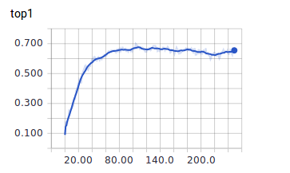

# devise-keras
The **master** branch contains code to setup the experiment, download/pre-process data for implementing the [Google-Devise paper](https://static.googleusercontent.com/media/research.google.com/en//pubs/archive/41869.pdf). `model.py` contains the code for the model. Due to computational constraints, the experiments are run on the [UIUC PASCAL sentences dataset](http://vision.cs.uiuc.edu/pascal-sentences/) as opposed to [ImageNet](http://www.image-net.org/). This dataset contains 50 images per category for 20 categories along with 5 captions per image.
The project uses the following python packages over the conda python stack:
- tensorflow 1.1.0
- keras 2.0.4
- tensorboard 1.0.0a6
- opencv 3.2.0

### How to Run the code
````
python extract_word_embeddings.py 

python shuffle_val_data.py

## Ensure DS_Store files are not in the image folders.

python clean_data.py TRAIN

python clean_data.py VALID

python extract_features_and_dump.py TRAIN

python extract_features_and_dump.py VALID

rm epochs/* ## Optional.

python model.py TRAIN
````

### Results
The network was trained for 250 epochs with 800 training images and 200 validation images.

#### Hinge Rank Loss

#### Top - 1 Accuracy

#### Top - 3 Accuracy

